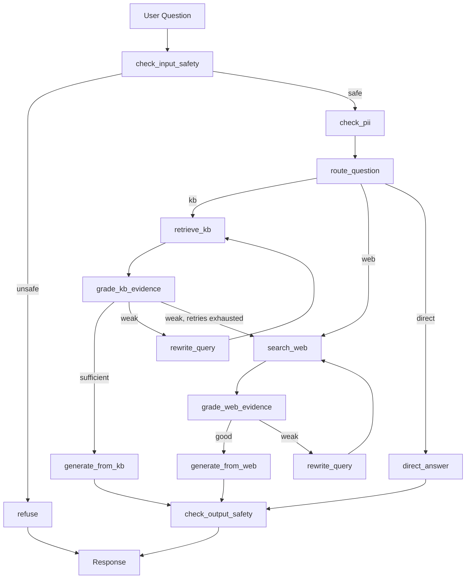

# Agentic RAG Assistant

An agentic Retrieval-Augmented Generation system that routes, retrieves, grades, and — when the knowledge base falls short — falls back to live web search, with production-oriented guardrails, PII redaction, caching, and full observability built in from scratch.

**[Live Demo](#)** · **[Architecture Diagram](#architecture)** · **[Evaluation Results](#evaluation)**

---

## Why this project

Most RAG demos stop at "retrieve chunks, stuff into a prompt." This project was built to answer a different question: what does a RAG system look like once you take it seriously as a piece of software that has to be *correct*, *safe*, *fast*, and *measurable* — not just functional?

Every major design decision below was made, tested, and in several cases *changed* based on evidence — not defaults. That evidence (eval numbers, latency traces, failure cases) is documented throughout this README rather than asserted.

---

## Architecture



The agent doesn't just retrieve-then-generate — it **decides**: whether a question needs retrieval at all, whether what it retrieved is actually good enough to answer from, and when to abandon a static knowledge base in favor of a live web search. This is the Corrective RAG (CRAG) pattern, extended with routing, guardrails, and resilience.

---

## Key features

### 🔍 Hybrid retrieval + reranking
- **Dense search** (OpenAI `text-embedding-3-small` + Pinecone) and **sparse search** (BM25) fused via Reciprocal Rank Fusion
- **Cross-encoder reranking** on the fused candidate pool before generation
- Chosen over dense-only retrieval based on measured evaluation gains (see [Evaluation](#evaluation))

### 🧭 Agentic routing and fallback
- A 3-way semantic router (`kb` / `web` / `direct`) decides how to handle each question — including recognizing time-sensitive questions a static KB structurally cannot answer, and routing those straight to web search
- An LLM-based evidence grader checks whether retrieved KB or web content is actually sufficient before generation proceeds
- A query-rewrite loop reformulates weak queries and retries retrieval before falling back further
- Citation/groundedness enforcement on final output — generation must be backed by retrieved evidence

### 🛡️ Guardrails
- **Input safety classifier**: detects prompt injection, jailbreak attempts, prompt leaking, malicious code requests, and illegal/harmful content requests — distinguishing genuine attacks from legitimate technical questions that happen to share vocabulary (e.g., "override the system prompt" *in LangChain* vs. targeting this assistant directly)
- **Output leak check**: verifies generated responses don't echo internal system prompt content
- **PII redaction**: incoming questions are scanned and redacted (email, phone, SSN, credit card) via Microsoft Presidio before reaching the embedding model, LLM, or trace logs
- **Rate limiting**: session-scoped request throttling

### ⚡ Performance
- **Two-tier caching**: exact-match and embedding-based semantic cache, with source-aware TTLs (static KB/direct answers cached indefinitely; web-fallback results expire after 3 hours to avoid staleness)
- **Resilience**: every external call (4 LLMs, Tavily) wrapped in exponential-backoff retry logic with graceful, non-crashing fallbacks on exhausted retries
- **Warm-start optimization**: model/client cold-start cost is paid once at app startup rather than on a user's first query

### 📊 Observability
- Full per-request tracing via LangSmith — every node, every LLM call, every routing decision is traceable end-to-end

---

## Evaluation

All metrics measured with [RAGAS](https://github.com/explodinggradients/ragas) against a golden set covering KB-answerable questions, web-fallback scenarios, adversarial inputs, and false-positive checks.

### RAG quality

| Metric | Score |
|---|---|
| Faithfulness | `[PLACEHOLDER]` |
| Answer Relevancy | `[PLACEHOLDER]` |
| Context Precision | `[PLACEHOLDER]` |
| Context Recall | `[PLACEHOLDER]` |

### Retrieval method comparison

Measured to validate that each added layer of retrieval sophistication actually improved results, rather than assuming it:

| Method | Score |
|---|---|
| Dense only (baseline) | `[PLACEHOLDER]` |
| Hybrid (dense + BM25) | `[PLACEHOLDER]` |
| Hybrid + cross-encoder reranking | `[PLACEHOLDER]` |

### Guardrail accuracy

| Check | Result |
|---|---|
| Adversarial detection (injection, jailbreak, leak attempts) | `[PLACEHOLDER]` correctly refused |
| False-positive rate (legitimate technical questions using guardrail-adjacent vocabulary) | `[PLACEHOLDER]` correctly answered |

> Guardrail tuning note: initial testing surfaced false positives on technical questions like *"How do I override the default system prompt in a LangChain ChatOpenAI call?"* — flagged for sharing vocabulary with real prompt-injection attempts. The classifier prompt was refined to distinguish questions **targeting this assistant** from **general technical discussion of the same concepts**, verified by rerunning both the adversarial and false-positive test sets to confirm the fix didn't weaken true-positive detection.

---

## Latency optimization

LangSmith trace profiling identified `retrieve_kb` (hybrid search + reranking) as the dominant cost in the pipeline — **7.94s of an 18.00s end-to-end request (44%)** on the original configuration.

Investigation with granular per-stage timing traced this to **missing caching**, not a fundamentally slow retrieval process: the cross-encoder reranker model and Pinecone client were being reconstructed on every single query instead of once per app lifetime.

| Configuration | `retrieve_kb` latency | Total latency |
|---|---|---|
| Baseline (no client/model caching) | 7.94s | 18.00s |
| + Singleton caching for reranker & vector store client | 3.59s | 8.93s |
| + Lighter cross-encoder model | `[PLACEHOLDER]` | `[PLACEHOLDER]` |
| Warm steady-state (post app-startup warm-up) | **~1.4s** | **~7.6s** |

Retrieval quality was verified to be preserved across configuration changes via RAGAS (`context_precision`/`context_recall` held steady, see [Evaluation](#evaluation)) — this was a latency fix, not a quality/latency tradeoff.

App startup now includes an explicit warm-up step (a throwaway dense search + rerank call) so this cold-start cost is paid once at boot rather than by whichever user happens to send the first question.

---

## Known limitations

Being explicit about what this project does *not* solve, rather than overclaiming:

- **Not architected for high-concurrency production traffic.** Streamlit's single-process model and provider API rate limits (OpenAI, Pinecone, Tavily) are binding constraints well below internet-scale traffic. A production version would need a stateless API backend (FastAPI), horizontal autoscaling, and a message queue.
- **Rate limiting is session-scoped, not IP-based.** Sufficient to prevent accidental runaway usage in a single session, not resistant to a determined multi-session abuser. Production would move this to an API gateway.
- **Semantic cache threshold is deliberately conservative.** Testing showed embedding cosine similarity does not cleanly separate genuine paraphrases from topically-similar-but-different questions (e.g., *"who hosted X"* vs. *"who won X"* scored higher similarity than a true paraphrase pair). The threshold is tuned to avoid false cache hits at the cost of some missed cache opportunities.
- **No multi-turn conversation memory yet** — each question is currently handled independently.
- **PII detection covers structured identifiers only** (email, phone, SSN, credit card); general free-text sensitive content is out of scope. `PERSON` entity detection was deliberately excluded after it produced false positives on domain-specific proper nouns (e.g., flagging "LangGraph" as a person's name).
- **Output content moderation is limited to system-prompt-leak detection** — does not include a general toxicity/bias check on generated answers.

---

## Tech stack

| Layer | Technology |
|---|---|
| Orchestration | LangGraph |
| LLM | OpenAI `gpt-4o-mini` |
| Embeddings | OpenAI `text-embedding-3-small` |
| Vector DB | Pinecone |
| Sparse retrieval | BM25 (`rank_bm25`) |
| Reranking | Cross-encoder (`sentence-transformers`) |
| Web search fallback | Tavily |
| PII detection | Microsoft Presidio |
| Evaluation | RAGAS |
| Observability | LangSmith |
| UI | Streamlit |
| Containerization | Docker |

---

## Running locally

```bash
git clone https://github.com/avina-sh/Agentic-RAG.git
cd Agentic-RAG
uv sync

# populate .env with:
# OPENAI_API_KEY=
# PINECONE_API_KEY=
# TAVILY_API_KEY=
# LANGSMITH_API_KEY=
# LANGSMITH_TRACING=true
# LANGSMITH_PROJECT=agentic-rag-project

python -m spacy download en_core_web_lg

# ingest the knowledge base (one-time, or whenever SOURCE_URLS change)
uv run python database.py

# run the app
uv run streamlit run app.py
```

### Running evaluations

```bash
uv run python evals/run_ragas_eval.py
uv run python evals/run_guardrail_eval.py
uv run python evals/run_retrieval_comparison.py
```

### Docker

A `Dockerfile` is included and tested locally. The live demo runs on Streamlit Community Cloud for simplicity and cost — Docker is provided as a deployment option for environments requiring containerization.

```bash
docker build -t agentic-rag .
docker run -p 8501:8501 --env-file .env agentic-rag
```

---

## What I'd build next

- Move conversation state to support genuine multi-turn memory
- Migrate to a stateless FastAPI backend + separate frontend for real horizontal scalability
- Expand PII detection to cover free-text sensitive content, not just structured identifiers
- LLM-based semantic equivalence check for cache hits, to improve hit rate beyond what embedding similarity alone can safely support
